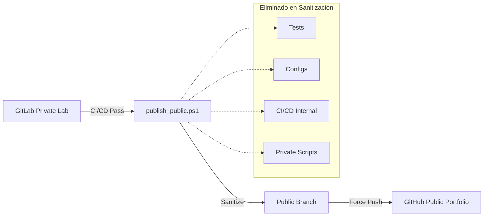

# 🚀 DataScope-API: Professional Exploratory Data Analysis


`DataScope-API` es una solución backend de grado profesional diseñada para el Análisis Exploratorio de Datos (EDA). Este repositorio implementa una arquitectura limpia, estándares de seguridad por diseño y un flujo de trabajo DevSecOps avanzado para la sincronización entre entornos privados y públicos.

## 🎯 Objetivo Técnico

Proporcionar una interfaz robusta y escalable para la ingesta, limpieza, procesamiento estadístico y visualización de datasets, permitiendo a científicos de datos y analistas acelerar el ciclo de descubrimiento de insights mediante una API de alto rendimiento.

## 🛡️ Enfoque Ético y Profesional

Este proyecto se desarrolla bajo principios de **Security by Design**:
- **Separación de Entornos**: El código completo, los tests de regresión y la automatización privada residen en GitLab.
- **Sanitización Automática**: Antes de la publicación en el portafolio público (GitHub), se ejecuta un proceso de limpieza que elimina lógica crítica, configuraciones sensibles y artefactos internos.
- **Responsabilidad**: Diseñado para fines educativos y profesionales, promoviendo mejores prácticas en el manejo de datos y seguridad de la información.

## 🏗️ Arquitectura del Repositorio

El proyecto utiliza una estructura **src-layout** para garantizar la modularidad y facilitar el empaquetado profesional:

```text
/ (root)
├── src/
│   └── app/            # Lógica central (FastAPI, Services, Core)
├── tests/              # Batería de pruebas (Exclusivo GitLab)
├── docs/               # Documentación técnica detallada
├── diagrams/           # Arquitectura y flujos del sistema
├── configs/            # Plantillas de configuración (.env.example)
├── scripts/            # Automatización DevSecOps (publish_public.ps1)
├── data/               # Persistencia de datos (uploads/outputs)
├── .gitlab-ci.yml      # Pipeline CI/CD (Linting, Test, Security)
└── README.md           # Documentación principal
```

## 🔄 Flujo DevSecOps: GitLab ➔ GitHub

Implementamos una estrategia de **Sincronización Sanitizada**:

1.  **GitLab (Source of Truth)**: Entorno privado de desarrollo con CI/CD completo, análisis estático de seguridad (SAST) y pruebas unitarias/integración.
2.  **Validación**: Cada cambio en `main` debe pasar el pipeline de GitLab.
3.  **Sanitización**: Ejecución de `scripts/publish_public.ps1`.
4.  **GitHub (Public Portfolio)**: Versión curada y segura para exhibición técnica.

### Diagrama de Sincronización



## 🚀 Instalación y Uso (Entorno de Desarrollo)

### Requisitos Previos

- Python 3.9+
- Entorno Virtual (`venv`)

### Configuración Rápida

```bash
# 1. Clonar repositorio (Desde GitLab)
git clone <gitlab-url>
cd DataScope-API

# 2. Crear entorno virtual
python -m venv venv

# 3. Activar entorno virtual
# En Windows:
.\venv\Scripts\Activate
# En Linux/macOS:
source venv/bin/activate

# 4. Instalar dependencias profesionales
pip install -r requirements.txt

# 5. Inicializar configuración
cp configs/.env.example .env

# 6. Ejecutar con PYTHONPATH ajustado
# En Windows:
$env:PYTHONPATH = "src"; python -m app.main
# En Linux/macOS:
PYTHONPATH=src python3 -m app.main
```

## 🛠️ Tecnologías Core

- **FastAPI**: Inyección de dependencias y rendimiento asíncrono.
- **Pandas/NumPy**: Motor de procesamiento de datos de alta eficiencia.
- **Seaborn/Matplotlib**: Generación de insights visuales de calidad editorial.
- **Pydantic V2**: Validación estricta de esquemas de datos.

## 📝 Estándar de Mensajes de Commit

Este proyecto sigue estrictamente el estándar **Conventional Commits**:
- `feat:` Nuevas funcionalidades.
- `fix:` Correcciones de errores.
- `refactor:` Cambios en el código que no alteran la funcionalidad.
- `security:` Mejoras o parches de seguridad.
- `ci:` Cambios en pipelines y automatización.

---

> [!WARNING]
> Las carpetas `data/uploads` y `data/outputs` están ignoradas por git para evitar fugas de información persistente. Asegúrese de mantener los archivos `.gitkeep` si desea conservar la estructura.
=/api/v1
MAX_FILE_SIZE=52428800
ALLOWED_ORIGINS=["*"]
PLOT_DPI=100
```

## 🧪 Testing

```bash
pytest tests/
```